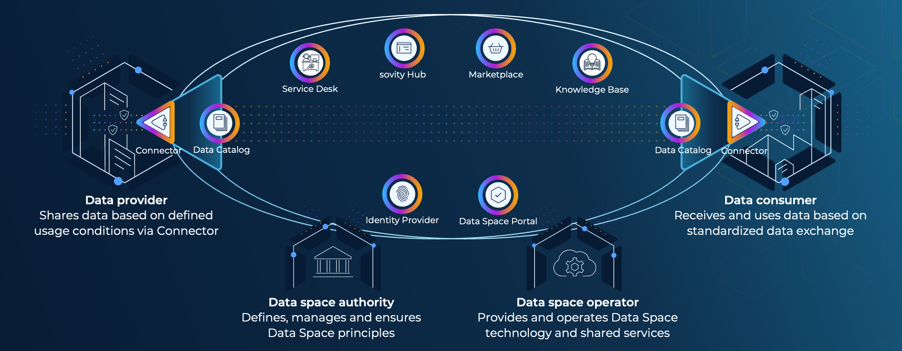
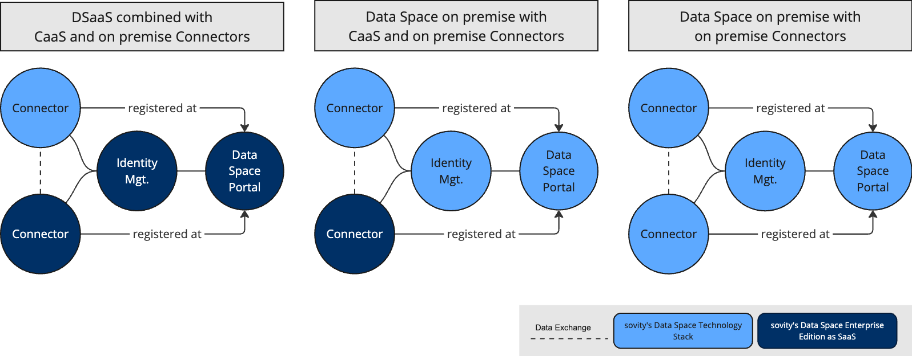

# sovity: Vision, Technology & Licensing for Data Spaces

## Our Vision for Data Spaces

We’re thrilled to see sovity's Data Space Technology Stack being widely adopted by individuals, industries, and research organizations. We’ve poured our passion and effort into creating the most advanced Data Space technology stack available, and we’re committed to offer free and highly usable components to the community.

We believe in the power of open-source to grow Data Spaces and foster collaboration by providing our technology as a Community Edition for free. Open-source components lower entry barriers, promote transparency, and enable the community to contribute, maintain, and extend solutions.

## Open-Source Community Edition and Enterprise Edition

The source code of our Community Edition of our Data Space Technology Stack is openly available to everyone on GitHub as open-source code.

For those seeking professional hosting, enhanced features and support, we offer our **Enterprise Edition** as SaaS solution:

- **Connector-as-a-Service (CaaS):** Seamlessly participate in various Data Spaces, including Catena-X and many others.
- **Data-Space-as-a-Service (DSaaS):** A full-featured package combining all relevant Data Space services (such as CaaS, Data Space Portal, and Data Space Identity Provider) with a range of additional support features:
  - User Management
  - Knowledge Base
  - Service Desk
  - SLA and more

## sovity's Data Space Technology Stack

A Data Space infrastructure acts like a foundation, much like an SDK for a smartphone operating system. Similarly, a Data Space allows you to build use-case-specific apps on top of its architecture, focusing on real-world business needs.

Our open-source Community Edition makes it easier for everyone to adopt and benefit from Data Spaces, eliminating vendor lock-in and fostering trust through transparency and community-driven improvements. Our Enterprise Edition wraps the Community Edition and enhances it with additional features and services.

### Data Space Components and Services

#### Connector

Connectors enable peer-to-peer data exchange while maintaining data sovereignty. Key features include:

- Data Cataloging
- Contract Negotiation
- Policy Enforcement

**Build Use-Cases around the Connector’s API**

- Use or develop a use-case app
- Connect the app to the Connector using its API or our improved API-Wrapper
- Control the use-case data flow through the Connector

**Admin and Developer-Friendly UI**

- **Consume Data:** Fetch data catalogs, negotiate contracts, and transfer data.
- **Provide Data:**  Define data offerings and set policies.
- **Monitor Data Flows:** Track transfers through the Connector’s transfer history.

#### Data Space Portal

The Data Space Portal simplifies participant onboarding and interaction. It provides capabilities like **Discovery Services** for locating participant endpoints or data within the Data Space.

**For Data Space Participants**

1. Register yourself and your organization.
2. Manage your organization’s details.
3. Invite users to your organization.
4. Explore data offerings in the Data Space Catalog.
5. Register on-prem Connectors or request Connector-as-a-Service.

**For Data Space Authorities**

1. Invite, onboard, and manage participants.
2. Monitor system components.
3. Get an overview of all registered Connectors.

#### Data Space Identity Provider

The Identity Provider ensures trusted data exchange by issuing and validating participant identities.

#### Knowledge Base

We offer two levels of documentation to meet different needs:

1. **Public Documentation**
   Comprehensive guides and resources are available for our Community Edition starting here: https://edc-ce.docs.sovity.de/

2. **Enhanced Customer Documentation** (for sovity customers):
    - More detailed User Guides
    - More detailed Developer Guides
    - More detailed API Specifications
    - More detailed FAQs and more

#### Service Desk (for sovity customers)

Our web-based ticketing system makes it easy to get help when you need it:

- **Rapid Response:** Quick issue resolution to minimize downtime.
- **24/7 Access:** Submit tickets anytime, anywhere.
- **Multiple Channels:** Depending on your subscription tier, you can reach us via call, email, or ticket submission.
- **Prioritized Support:** Tickets are categorized by their severity for prioritization and faster ticket handling and to escalate through different support levels.

#### sovity Hub (for sovity customers)

Our sovity Hub empowers you to manage Connectors, use cases, and monitor usage:

- **Organization Management:** Invite users and define access rights.
- **SSO Integration:** Connect your own Identity Provider (IDP).
- **Component Configuration:** Manage service accounts to access your service's API.
- **Component Monitoring:** Check statuses, hosting details, logs, metrics, and performance reports.
- **Contract Management:** Easily manage your contracts.

#### Use Case Bundles (for sovity customers)

We offer certified use case bundles tailored to specific needs, such as Catena-X. Contact us to learn more about our offerings!

## How to use our open-source Community Edition

Our open-source Community Edition gives you full control and flexibility to explore and implement Data Spaces according to your specific needs. You can self-host the software to build secure and scalable data-sharing solutions, customize features to align with your business use cases, and even contribute improvements back to the community. We foresee three diffeerent hosting archetypes depicted below:

- **DSaaS combined with CaaS and on premise Connectors**: You receive the full DSaaS with CaaS to fully focus on your business applications. For sure, Data Space Participants can host the Community Edition of the Connector on their own and enroll it into the Data Space.
- **Data Space on premise with CaaS and on premise Connectors**: You want to have the full control over the Data Space components? No problem! You can make use of our CaaS as an optional service, to make it easier for Participants to get technically onboarded.
- **Data Space on premise with on premise Connectors**: You host the Community Edition of sovity's Data Space Technology Stack and Participants host their Connectors.

In all three scenarios we welcome you to contribute to the Community Edition:

- **Fork and Use Our Code**: You can fork the source code from GitHub and deploy the Community Edition in your own environment, allowing full control over configuration and customization to fit your business needs as allowed by their respective licenses.
- **Contribute**: Join our developer community and help improve the projects by submitting pull-requests under Apache 2.0 on GitHub, reporting issues, or suggesting new features.
- **Licensing Options**: If you’re a company interested in reselling the software or providing managed services in specific Data Space scenarios, reach out to us for tailored licensing agreements. We offer custom solutions for partners, research institutions, and IT subsidiaries.

## License Setup

To maintain openness and sustainability while ensuring proper use, our Community Edition is governed by different open-source licenses.

### License Overview

| Community Edition                                                  | License             | Key Permissions                  | Key Restrictions                            |
|--------------------------------------------------------------------|---------------------|----------------------------------|---------------------------------------------|
| [EDC Connector CE](https://github.com/sovity/edc-ce)               | Elastic License 2.0 | Use, copy, modify                | Cannot offer as SaaS or bypass license keys |
| [Data Space Portal CE](https://github.com/sovity/dataspace-portal) | AGPLv3              | Use, modify, distribute          | Must provide source code                    |
| [DAPS CE](https://github.com/sovity/sovity-daps)                   | Apache 2.0          | Full use and modification rights | None                                        |

### **sovity's EDC Community Edition: Elastic License 2.0**

**Allowed:**

- Use, copy, distribute, and create derivative works.

**Restricted:**

1. You cannot offer the product as SaaS.
2. You cannot bypass license key functions or remove protected features.
3. You cannot alter or remove licensing, copyright, or other notices.

[Elastic License 2.0 Details](https://github.com/elastic/eui/blob/main/licenses/ELASTIC-LICENSE-2.0.md)

### **sovity's Data Space Portal Community Edition: AGPLv3**

**Allowed:**

- Use, copy, distribute, and create derivative works

**Required:**

- If you modify the software and use it over a network (e.g., SaaS), you must make the source code available to your users.

This license enables **data spaces to host the Data Space Portal while sharing enhancements** for the benefit of the wider community.

[AGPLv3 Details](https://github.com/IQAndreas/markdown-licenses/blob/master/gnu-agpl-v3.0.md)

### **sovity's DAPS Community Edition: Apache 2.0**

**Allowed:**

- Full flexibility for use, modification, and distribution without source code disclosure.

[Apache 2.0 Details](https://github.com/IQAndreas/markdown-licenses/blob/master/apache-v2.0.md)

### Custom Licenses for Partners and Researchers

We understand that some use cases and Data Space Participants require more flexibility. That’s why we want to encourage you to reach out to us for a custom license:

- **Research Purposes:** Researchers working without monetization goals can host instances for consortium partners.
- **IT Subsidiaries:** Subsidiaries can host the Connector on behalf of a parent company.
- **Partners and Customers**: Our customers and partners can request tailored agreements, such as:
  - Authorities migrating from sovity-hosted DSaaS to self-hosted solutions
  - Resellers or partners operating the software stack

### What is important when you Contribute?

You need to sign the **Contributor License Agreement (CLA)** when you do a pull request. In a nutshell: Your contributions will be licensed under **Apache 2.0**. This ensures that you retain full freedom to use your contributions in other projects. Only the bundled code and resulting docker images will follow the licenses described above. Be assured: We value every contribution and are committed to fostering a collaborative and innovative community!

## FAQ

### General

**Q: How will the change in license affect contributions from the community?**  
**A:** Contributions to our Community Edition are warmly welcomed under the Apache 2.0 license, as outlined in the Contributor License Agreement (CLA).

**Q: Are there any legal implications users should know about with the new licenses?**  
**A:** The main changes are:

- **sovity's EDC Connector Community Edition** is licensed under Elastic License 2.0, which prohibits hosting it as SaaS for third parties.
- **Data Space Portal** is licensed under AGPLv3, requiring you to provide the source code to users (e.g., your Data Space participants).  
  For detailed information, please refer to the license files in each repository.

**Q: How does the new license affect the commercial use of the software?**  
**A:** Commercial use is for sure allowed and unrestricted, as long as you stick to the software licenses.

### EDC Connector

**Q: Can I adjust and enhance the sovity EDC Community Edition, compile it myself, and share it publicly?**  
**A:** Yes, you can! Just ensure that:

- You don’t offer the software as a managed service.
- You don’t alter or bypass the license key functionality.
- You don’t change or remove the applied license.

Check the license for full details.

**Q: Do I need to publish my modified code?**  
**A:** No, you’re not required to publish your modifications.

**Q: Can I offer a Connector-as-a-Service to others?**  
**A:** Not under the current license. However, we provide custom licensing agreements for specific use cases, such as research projects, IT services of subsidiaries or our partners and customers. Feel free to reach out to us to discuss options!

### Data Space Portal

**Q: Do I need to connect the Data Space Portal to sovity's API?**  
**A:** No, it’s not required. You can run the Data Space Portal entirely on your own. If you’re considering hosting Connectors as SaaS, check the Connector FAQ about custom licenses.

**Q: Can I adjust the code and redistribute it?**  
**A:** Absolutely!

**Q: Can I host the Data Space Portal and fund it with a membership fee?**  
**A:** Yes, that’s perfectly fine!  
